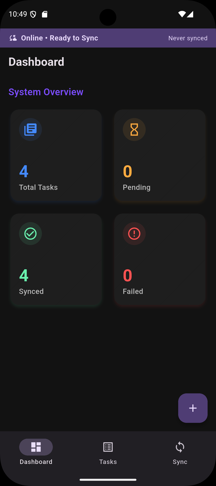
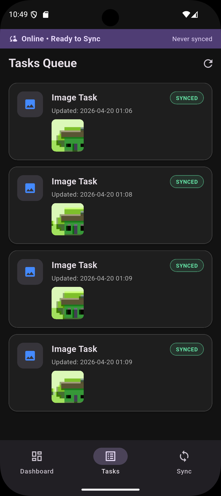
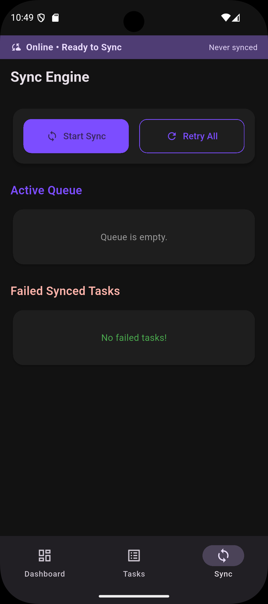

# 📱 Offline Data Collection App

> A robust Flutter application demonstrating an **offline-first architecture** with a local SQLite queue, automatic background sync, and exponential backoff retry logic.

[](https://flutter.dev/)
[](https://nodejs.org/)

---

## 📸 Screenshots

<p align="center">
  
  
  
</p>

---

## ✨ Features

- **📝 Offline Task Creation**: Create text and image tasks even without connectivity.
- **🗄️ Local Storage**: Powered by [Drift](https://drift.simonbinder.eu/) (SQLite) for a robust local sync queue.
- **🔄 Smart Sync Engine**: Background sync engine featuring retry mechanisms and exponential backoff.
- **📡 REST API**: Seamless integration with the mock Node.js backend using Dio.
- **🖼️ Media Support**: Capture and store images directly via device camera.

---

## 📂 Project Structure

```text
lib/
├── core/
│   ├── network/        # Dio API service & config
│   ├── providers/      # Riverpod providers
│   └── sync/           # Sync engine models
├── data/
│   ├── local/          # Drift database, DAOs, models
│   └── repositories/   # Repository implementations
├── domain/
│   └── repositories/   # Repository interfaces & entities
└── features/
    ├── dashboard/       # Home screen & stat cards
    ├── sync/            # Sync screen & widgets
    └── tasks/           # Task list & creation screens
backend/
└── server.js           # Node.js Express mock backend
```

---

## 🚀 Getting Started

### Prerequisites

Ensure you have the following installed before proceeding:
- [Flutter SDK](https://docs.flutter.dev/get-started/install) (3.x+)
- [Node.js](https://nodejs.org/) (18+)
- An Android device with USB debugging enabled **OR** an Android emulator
- Android SDK `platform-tools` (`adb`) configured in your system PATH

### Setup & Running

#### 1. Install Flutter Dependencies
```bash
flutter pub get
```

#### 2. Start the Backend Server
```bash
cd backend
npm install
node server.js
```
> The server runs on `http://localhost:3000`

#### 3. Connect your Android Device (Physical Device)
Plug your phone in via USB, then run:
```bash
adb reverse tcp:3000 tcp:3000
```
*This tunnels `localhost:3000` **on the phone** to `localhost:3000` on your PC — no IP configuration needed.*
> ⚠️ **Note:** Re-run this command each time you reconnect the device or restart ADB.

#### 4. Run the Flutter App
```bash
flutter run
```

---

## 💻 Emulator Usage

If you prefer using an emulator, no extra `adb reverse` commands are needed. The emulator uses `10.0.2.2` to natively reach the host machine. 

Simply set `useEmulator = true` in `lib/core/network/api_service.dart`:

```dart
static const bool useEmulator = true;
```

---

## 🔌 API Endpoints

| Method | Endpoint  | Description          |
|--------|-----------|----------------------|
| `GET`  | `/health` | Server health check  |
| `POST` | `/tasks`  | Upload a task        |
| `GET`  | `/tasks`  | List all stored tasks|

### Example POST Payload
```json
{
  "id": "task_123",
  "title": "My Task",
  "type": "text",
  "payload": { "content": "Hello" }
}
```

---

## 🛠️ Troubleshooting

| Problem | Solution |
|---------|----------|
| **`Connection refused` on device** | Run `adb reverse tcp:3000 tcp:3000` |
| **`Connection timeout` on device** | Check `adb reverse` is active; ensure USB debugging is on |
| **Emulator can't reach server** | Set `useEmulator = true` in `api_service.dart` |
| **`adb` not found** | Add Android SDK `platform-tools` to your system PATH |
